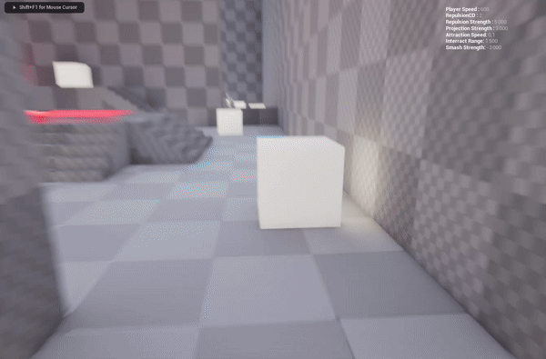
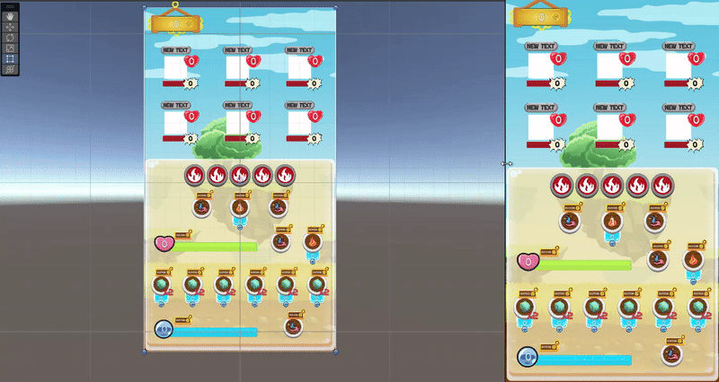

# My Skills

I'm currently completing my degree in Video Game Development, specializing in Game Design and Programming. I see myself as a versatile Developper, able to adapt quickly to a project. For more details, I invite you to discover the details of my skills and fields of expertise just below:

- [Game Design Skills](https://github.com/Doerys/Portfolio/blob/main/2_Skills/MySkills.md#game-design-skills)
- [Gameplay Programming Skills](https://github.com/Doerys/Portfolio/blob/main/2_Skills/MySkills.md#gameplay-programming-skills)
- [Others Skills and Softwares](https://github.com/Doerys/Portfolio/blob/main/2_Skills/MySkills.md#others-skills--softwares)
- [Soft Skills](https://github.com/Doerys/Portfolio/blob/main/2_Skills/MySkills.md#soft-skills)

## Game Design Skills

### Creativity / Concepts

I'm often described as imaginative. I spend hours every day **brainstorming or writing down lists of ideas**. But my favorite part of creating a video game is working and reflecting on these ideas, until they become a project that **makes sense, is relevant and coherent**. I know how to apply the MDA framework to move in that direction.

I think about a project not from just one angle, but from many. I would define my approach as **multidisciplinary**: I take into account the different specialties involved in the project, and therefore the people involved, in order to assess its overall coherence, and above all its **feasibility**.

Finally, I'm comfortable doing **R&D in a specific sector, genre or type of gameplay functionality**, which enables me to assess the interest of a project and the relevance of an idea in relation to an existing market or competing games. My affinity for **action-adventure, FPS and narrative games** (you can take a look at [my favorite game licenses here](../4_ThingsILike/ThingsILike.md)) gives me a good expertise and understanding of these games, their design and the offerings on the market.

### Prototyping

To ensure the feasibility of a game mechanism or function, I'm not afraid to go to the engine and **iterate through prototyping**. My knowledge of programming is an asset that I like to combine with my game design skills, so that I can **associate theoretical reflection with concrete creation**.

  
*You can see here a feature I prototyped in one day on the game engine, during the R&D phase of [Tinykinesis](../3_Projects/Tinykinesis/Tinykinesis.md). The goal was to check the possibility of implementing telekinesis capabilities.*

### Situation Design

I'm able to do Situation Design, so that I can draw up a list of situations that I can mobilize to create a game sequence. I understand the basics of the **Flow Model**, so that this sequence of situations follows a balanced curve in terms of challenge. However, I'd like to gain more experience on this subject, to fully appropriate this framework.

## Gameplay Programming Skills

### Hierarchy and Architecture

I attach great importance to code **optimization and maintainability**. To guarantee this, after a short prototyping phase to test the engine's capabilities, I think about the structure of my code before I even start coding, so that it's **clean, logical and above all understandable**. For this last point, I systematically create an **architecture diagram** that I make accessible to the other members of my team.

I hunt down code repetition, and try to **factorize** it a lot. I generally rely on the **parent class system**, **interfaces and delegates**, but I'm open to learning other design patterns that would help me further optimize my code.

### Unity (C#)

I have good practice in **UI / UX programming**, and know how to set up a responsive interface that is fun to interact with. I have a sufficient knowledge base to implement **simple 3C features** on Unity, although I'd like to experiment more in this area.

*Here's an example of a Responsive UI I made for a phone clicker game: [Clicker Quest Adventure](../3_Projects/Clicker%20Quest%20Adventure/ClickerQuestAdventure.md)*.

When it comes to optimization, I know how to ensure that functions are implemented correctly, in an optimized hierarchy, notably by using **Prefabs**. I also know how to do Data-oriented Programming using **Scriptable Objects** and **Enums**.

I would add that I am also able to follow **the production of mobile games**. In fact, I've worked on two student projects whose aim was to create games for mobile devices: [Clicker Quest Adventure](../3_Projects/Clicker%20Quest%20Adventure/ClickerQuestAdventure.md) and [Rolland de Rennes](https://maerys.itch.io/rolland-de-rennes).

Finally, although I've had less opportunity to experiment with these tools to the point of making them my own, I have some basic knowledge of:

- VFX
- Sound integration
- Light integration

To find out more, I invite you to take a look at these various projects done on Unity:
- [Tick](../3_Projects/Tick/Tick.md)
- [Clicker Quest Adventure](https://github.com/Doerys/Portfolio/blob/main/3_Projects/Clicker%20Quest%20Adventure/Clicker%20Quest%20Adventure.md)

### Unreal Engine (Blueprints)

I've used **Character, Controller and Input Actions** enough to build up a good knowledge base of how to use them correctly for 3C Programming. I also know how to **handle physics** within the engine, and I have enough experience of collision management to understand how to set up and work with **Collision Presets**.

Concerning optimization, I know how to ensure proper implementation of functions within an optimized hierarchy, using **Events Dispatcher and Blueprint Interfaces**. I also can do data-oriented programming using **Data Assets, Data Tables and Enums**.

Overall, I understand the benefits of **Game Instance and Game Save**, and am able to use them to transfer data between scenes. 

Finally, although I've had less opportunity to experiment with these tools to the point of making them my own, I do have some basic knowledge of:

- **Widget Blueprints** for UI / UX Programming,
- **Behavior Trees, Blackboards & BTT Tasks** for AI Programming,
- **Animations Blueprints**
- **Tech Art Tools** (Shaders, Niagara Systems)
- **Dev Tools creation**

To find out more, you can check my graduation project [Tinykinesis](../3_Projects/Tinykinesis/Tinykinesis.md), which was extremely instructive in my learning of Unreal Engine's programming tools.

As a bonus, I have a good understanding of the level design tools offered by the engine (you can see it in the [relevant category](https://github.com/Doerys/Portfolio/blob/main/2_Skills/MySkills.md#level-design) below).

### Other Languages

I've been able to practice **JavaScript** by working on a number of projects using the Phaser 3 game engine. To see some of these games, please visit my [itch.io page](https://maerys.itch.io/).

## Others Skills & Softwares

### Project Management

During the various school projects and game jams I've done, I've been able to familiarize myself with different organizational softwares, such as **Taiga and Trello**. I make good use of these softwares to keep track of the **progress of a project and my own tasks**, particularly by following the **agile method via the creation of sprints**. I also like to use the softwares of **Microsoft and Google** for planning, communication and document creation. 

### Version Management

The systematic use of Github in each of my school and Game Jam projects has left me with a solid knowledge base for understanding how this software works, how to **merge versions correctly**, and how to **resolve conflicts** between different branches.

### Level Design

I have a good appreciation of Level Design and Level Art. Through school projects and game jams, I've been able to improve my level-building skills, and I now systematically apply an **iterative process** to make the flow and understanding of these levels as **instinctive and fun** as possible. 

To find out more, take a look at [this page summarizing my biggest Level Design projects](../3_Projects/Others/Level%20Design_Projects/LevelDesign_Projects.md).

### Storytelling / Worldbuilding

Before I became professionally interested in video games, my ambitions were focused on **writing and storytelling**. As a result, I have a keen interest in the narrative aspect of games (not just video games, but other media such as T-RPGs), particularly in **worldbuilding** and the feeling of **living a story** through an interactive medium. 

This is reflected in some of my projects, which you can discover on [this page where I show some details about Narrative Projects](../3_Projects/Others/Storytelling%20Worldbuilding_Projects/StorytellingWorldbuilding_Projects.md).

### Art & Video Softwares

Even if my professional ambitions don't lie in visual creation, I have a **good knowledge of art and image culture** (I have a degree in cinema and audiovisual studies). I also have a good knowledge of **Graphic Design software tools** (Photoshop, Illustrator, Indesign) to produce visuals convincing enough to translate my ideas into a first draft, whether by **producing an illustration or factorized drawing**, by **retouching a picture** or by using **photobashing**.

If you're interested, you can take a look at my [2D creations on this page](../3_Projects/Others/2D%20Art_Projects/2DArt_Projects.md).

I've also mastered the basics of **Premiere Pro** for video editing, which I've used to make short films or 2D animation / stop motion, as well as a good understanding of **Audacity** for mixing and audio recording.

You can take a look of this Animated short film - [Les Aventures de Patablou](https://youtu.be/US73xBjlbbo?si=cIYuoPGiqQgEc2hR) - to check my work on editing, animation and audio mixing. 

### 3D Engines

I know and am able to apply a basic **3D creation pipeline**, including modeling, UV mapping, texturing and integration within the engine. This is a great help in understanding what 3D artists do within a production.

For an example, here's [Pop the Bubble](https://maerys.itch.io/pop-the-bubble), a game jam project in which I had fun doing nothing but 3D modeling.

## Soft Skills

### Communication

I’m used to **working in a team** (most of my projects were created by a team of 4 persons or more), so I have a tendency to share information and communicate between team members. During my studies and game jams, I have learned to communicate effectively with **Designers, Programmers and Artists** in order to work in the same direction.

I'm very comfortable **sharing my ideas and opinions on a project**, whether internally with my team members, or as part of a written or oral presentation. 

I have a very good command of **Word Processors** (Word, Google Docs...) to create clear, chaptered, illustrated documentation, using the right style settings and dynamic links.

Finally, I've mastered **presentation tools** such as Google Slides, Powerpoints and Canva, so I can create slides that are legible, clear and attractive, and set up templates to simplify slide creation for an entire team.

### Adaptation

I’m a **fast learner**, and I can familiarize myself with a tool or work process in just a few iterations, even on software or subjects on which I have little experience. I can search the Internet, forums and engine documentation effectively, so I know **where and how to find the answer** to many problems.

### Organisation

My curiosity and need for understanding drive me to take an interest in the work of my team members, to gain a global vision and understanding of a project. I rarely work in isolation and **always collaborate with other members of my team**, especially when it comes to making decisions: it's important for me to **cross opinions** to make sure I'm making the right choices.

I organize my work in a **very rational and pragmatic way**, and this tends to radiate around me within my team. I generally **adapt my planning and tasks collectively**, so that they are coherent, even beneficial, with those of others.

---

[Get back to the main page](../README.md)

