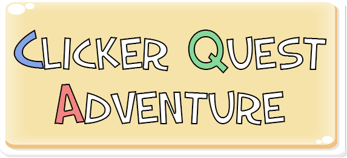
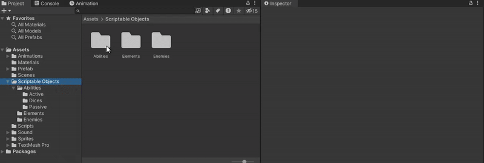
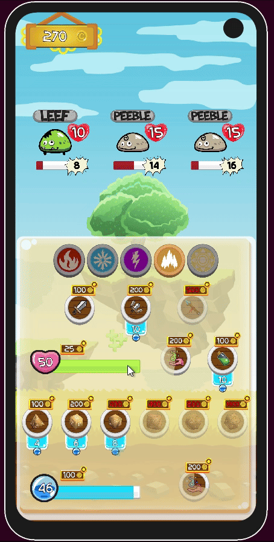

# Clicker Quest Adventure

> ESMA - Rennes  
> Student Project - 2024 - 1 Month  
> Unity - C#  
> Solo project

## Context
Clicker Quest Adventure is a school project produced as part of a programming course. The aim was to create an idle game or a clicker, in order to practice UI / UX programming and the use of Scriptable Objects on Unity.

This game is a **clicker designed for phone platform**, incorporating **RPG mechanics**: the player clicks on the mobs that appear on the screen in order to defeat them before they launch their attacks. 

By defeating the mobs, the player collects money which he can use to unlock special abilities and improve his stats, such as health and mana. Difficulty increases as the player gets stronger.

In addition, an elemental system allows the player to increase its damage depending on the type of mobs he face.

## What I Learned

This project enabled me to practice **UI / UX Programming** on Unity. At the end of the project, I was able to set up a **responsive UI**, capable of adapting to any screen resolution. 

I improved my **data-oriented programming skills**, using **Scriptable Objects** to implement a large variety of mobs and abilities. At the same time, I learned how to use **Prefabs** efficiently with Scriptable Objects, for optimization purposes. I also discovered **Enums** and used them to set up an elemental system.

This project was also an opportunity to discover time management tools such as **Coroutine**, in order to set up temporal events such as the duration or cooldowns of abilities, and mob attack charges. To ensure a juicy and enjoyable experience, I learned how to implement **UI Animation**, **visual and sound effects**, which allowed me to add a lot of feedback.

## More About This Projet
[Itch.io page if you want to test this game!](https://maerys.itch.io/idle-quest-adventure)
