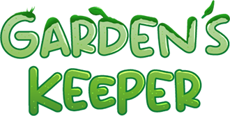

# Garden’s Keeper

> ESMA - Rennes  
> Student Project - 2023 - 2 Months  
> Phaser 3 - Javascript  
> Solo Project  

## Context

Garden's Keeper is a first-year student project, the aim of which was to create a **Zelda-like game**.

In this pixel art style adventure game, you play the role of a radish hero returning to his homeland invaded by plant monsters. The game consists of a **complete Zelda-like experience**, including an introductory level, a hub, 2 levels with their own specific mechanics and mobs, and a dungeon. With each level, the player unlocks a new ability to access new areas of the game.

After working for 1 full month on this project in a scholar context, I went back on this project during summer vacation for another month, in order to improve the experience by adding some missing features, such as npc dialogues, resurrection, hidden pickup objects, a new mob, a final boss and an ending cinematic.

## What I Learned

This project was a very stimulating experience that challenged my game design skill. A lot of thought went into creating the character and player abilities, mobs, obstacles and puzzles so that they were both **fun and consistent** with the colorful world and light-hearted tone I wanted to establish. The final product really gives me the **old-school vibes of early Zelda games**, which is why I’m so proud of this project.

Even though the programming architecture is a step down from my current programming skills (there is a 2709 lines script file...), this project was a great step forward in improving my programming skills at the time. It was very instructive on **3C and AI programming** and on **data transmission between scenes**.

In addition, this project was an opportunity to improve my **level designs**, **UI art** and **pixel art skills**. I invite you to click on the links below if you'd like to find out more!

## More About This Projet

[Itch.io page if you want to test this game!](https://maerys.itch.io/gardens-keeper)  
[Level Design Oriented Presentation](https://github.com/Doerys/Portfolio/blob/main/3_Projects/Others/Level%20Design_Projects/Level%20Design_Projects.md#gardens-keeper)  
UI Art Oriented Presentation (later)  
2D Art Oriented Presentation (later)  

---

[Get back to the project page](../MyProjects.md)  
[Get back to the main page](../../README.md)
