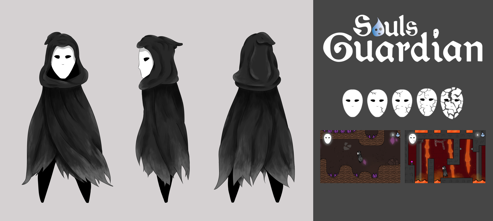
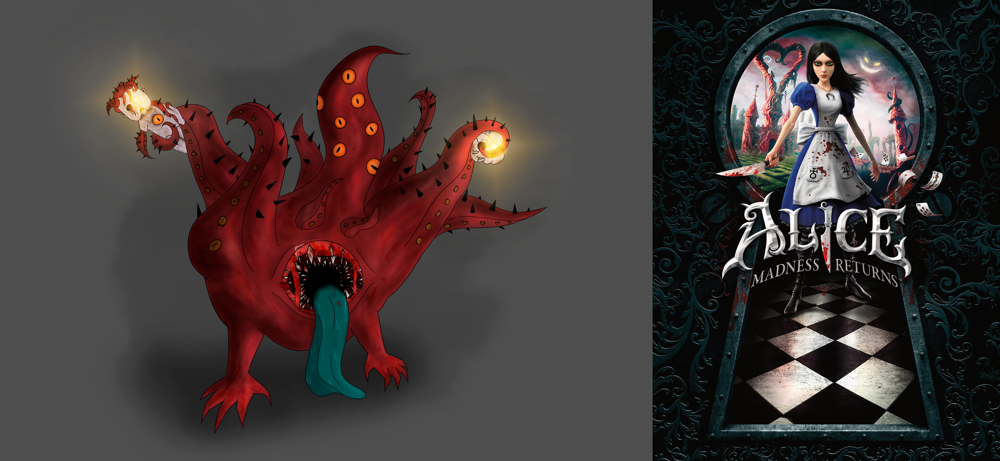
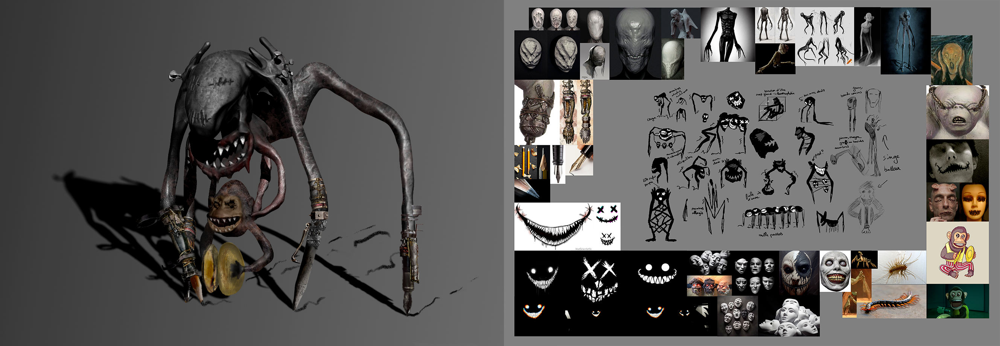
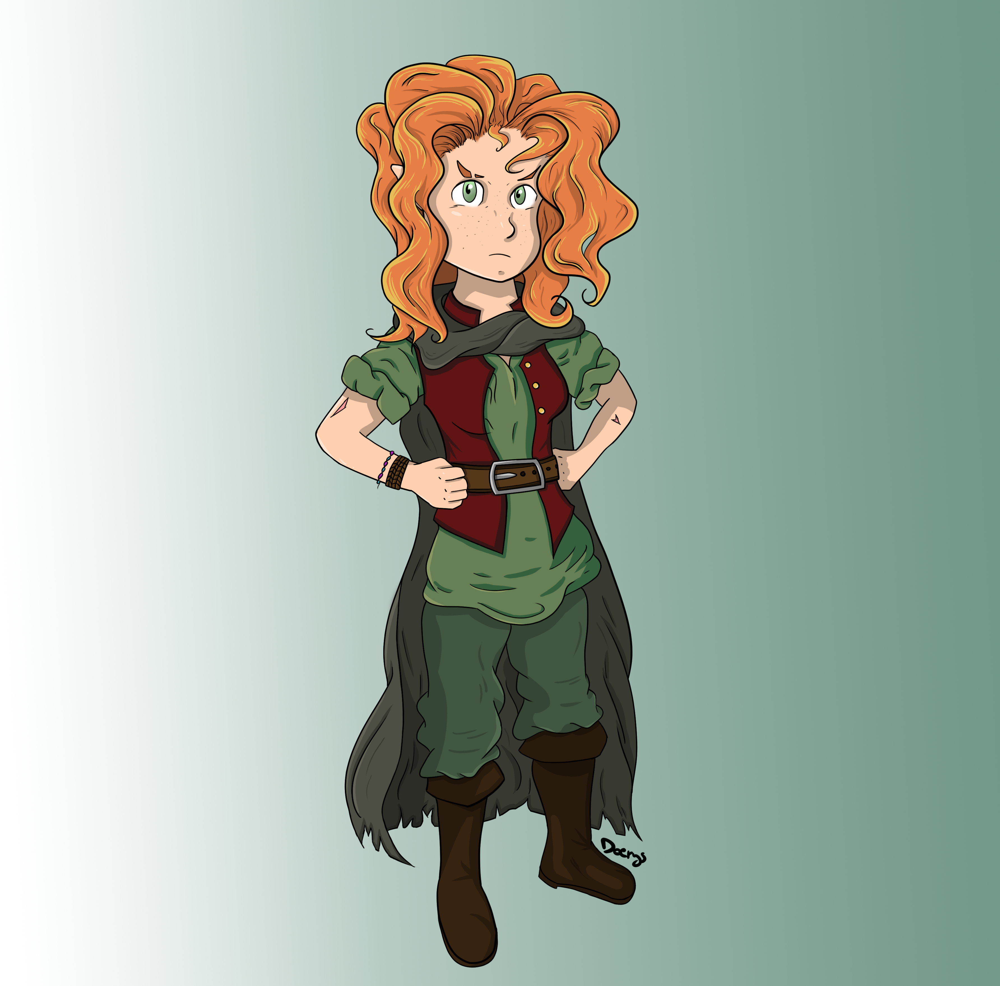
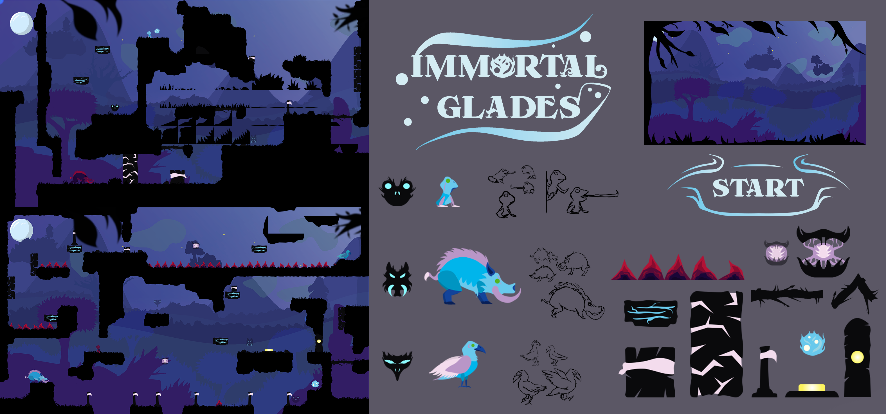

# 2D Art Projects

## Concepts arts / Chara Designs 

### Souls' Guardian
  
> ESMA - Rennes  
> Student Project - 2022 - 1 Month  
> Photoshop  
> Solo project

Souls’ Guardian is my first-year student video game project, the aim of which was to create a **2D Side Scroller** on Phaser 3.

In terms of artistic creation, the goal was to create a **concept art for our in-game character**, who would evolve in a level divided in 3 biomes.

I started with the concept of a fallen being seeking to gather lost souls on earth, to bring them back to paradise. I'm pretty proud of the way I've managed to radiate the concept of the character into different elements of the game, such as the **logo and the life interface**.

__If you are interest to reach more about this project__:   
[Itch.io page if you want to test this game!](https://maerys.itch.io/souls-guardian)  

---

### Alice Madness Return - Monster Concept

> ESMA - Rennes  
> Student Project - 2022 - 2 Weeks  
> Photoshop  
> Solo project  

This project was made during 2D Graphics courses, and involved inventing an **original monster in the Alice Madness Return game universe**. It was a challenging project requiring much research into the artistic direction of the universe, in order to appropriate it and create something new.

I wanted a monstrosity with tentacles, manipulating the doll heads sometimes found in the game. I even thought about this concept in terms of game design, imagining this monster as a mob designed to trap the player by luring him in with its luminous dolls.

---

### Post-apocalyptic World Concept

> ESMA - Rennes  
> Student Project - 2023 - 1 mouth and 2 weeks  
> Photoshop  
> Solo project

This project was carried out as part of the 2D Graphics course, and involved **creating a character wielding a weapon, a vehicle and an entire environment** in a post-apocalyptic world. We had to respect certain **constraints**, and mine were that my post-apocalyptic world took place 2 years after a supernatural apocalypse, in Italy, in a world on the way to improvement.

So I chose to set the scene in "La Nuova Gerusalemme", a **post-apocalyptic Vatican**, where divinely-elected people have been given the power to protect mankind from demons descending on earth, drawing inspiration from the New Testament's Apocalypse.

Following the exercise instructions, the work mainly involved **photobashing** from photographs taken in course and images found on the Internet, but also **painting** for the vehicle. A great deal of **lighting** work was also carried out to make the environment and characters credible.

---

### Zbrush Monster Concept

> ESMA - Rennes  
> Student Project - 2024 - 2 Weeks  
> Zbrush / Photoshop  
> Solo project

This project was carried out as part of the 2D Graphic course and involved creating **a monster representing a fear**, using **Zbrush** to establish a sculpted base for the monster, then reworking it in **Photoshop** by adding textures, lights and details.

I invented this concept of a **monster trapped inside an artist's head**. The posture of the limbs, the various motifs and elements used, as well as the colors, are designed to evoke anxiety, imposter syndrome and fear of blank page syndrome. My central ambition was to represent a fear that is both silent and deafening.

---

### Dungeons and Dragons Chara Design - Brigonia

> Personal project - 2024 - 1 full day  
> Photoshop  
> Solo project

My goal was to create a complete representation of **one of my D&D characters**: Brigonia, a Rogue Half Moon. The style was largely inspired by the graphic style of the artist named [Elwensa](https://www.deviantart.com/elwensa).

## 2D Assets & Animations

### Immortal Glades

> ESMA - Rennes  
> Student Project - 2023 - 1 month and 2 weeks  
> Illustrator / Animate  
> Solo project

Immortal Glades is my last video game project as a first-year student, with the aim of creating a **2D Platformer** game on Phaser 3. We were challenged on all levels: Game Design, Programming, Art and Level Design.

In this **puzzle game**, you play a spirit trapped in a magical forest where animal spirits have been corrupted. Your main objective is to traverse the levels to heal them. To do this, you can **take possession of different animals**, each with specific abilities: the frog has a grappling light and can jump on walls, the boar is heavy and can move very fast when charging, and the crow can double-jump, glide and fire projectiles.

I took advantage of this project to try my hand at a new artistic style: **flat design**, inspired by the game [Eternal Hope](https://store.steampowered.com/app/1162280/Eternal_Hope/?l=french), whose Artistic Direction seduced me. It was also an opportunity to gain experience with **Illustrator**. Working with vectorized files, I was able to use and practice **Animate**, to efficiently produce fluid, high-quality 2D animations. This project was extremely refreshing, as it allowed me to experiment with a whole new artistic creation process. The visual results really spoke to me.

## UI / UX

### Royal Rumble

### Journey - Box Concept

### Rolland de Rennes

### Racing Game - Main Screen Concept
