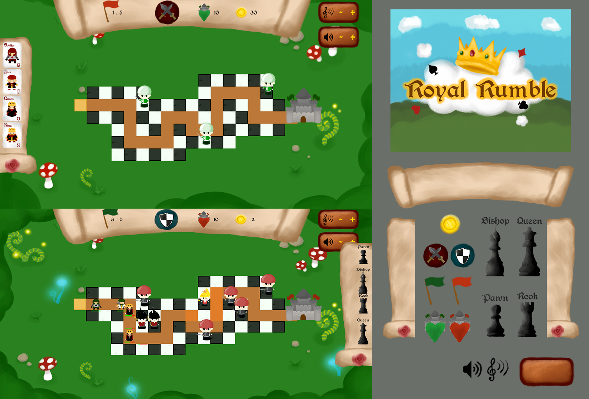
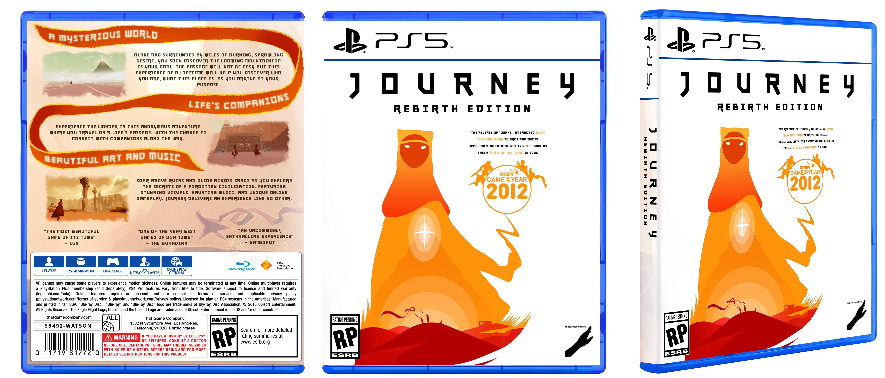
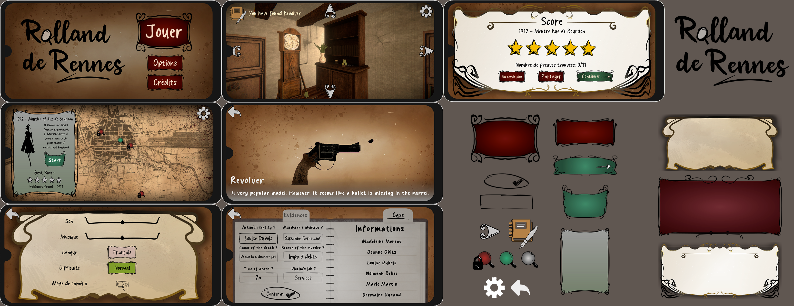

# 2D Art Projects

## Concepts arts / Chara Designs 

### Souls' Guardian
  
> ESMA - Rennes  
> Student Project - 2022 - 1 Month  
> Video Game - Solo project  
> Phaser 3 / Tiled / Photoshop  
> Game Designer, Programmer, Level Designer, Artist

Souls’ Guardian is my first-year student video game project, the aim of which was to create a **2D Side Scroller** on Phaser 3.

In terms of artistic creation, the goal was to create a **concept art for our in-game character**, who would evolve in a level divided in 3 biomes.

I started with the concept of a fallen being seeking to gather lost souls on earth, to bring them back to paradise. I'm pretty proud of the way I've managed to radiate the concept of the character into different elements of the game, such as the **logo and the life interface**.

__If you are interest to reach more about this project__:   
- [Itch.io page if you want to test this game!](https://maerys.itch.io/souls-guardian)  

---

### Alice Madness Return - Monster Concept

> ESMA - Rennes  
> Student Project - 2022 - 2 Weeks  
> 2D Graphic Class - Solo project  
> Photoshop    

This project involved inventing an **original monster in the Alice Madness Return game universe**. It was a challenging project requiring much research into the artistic direction of the universe, in order to appropriate it and create something new.

I wanted a monstrosity with tentacles, manipulating the doll heads sometimes found in the game. I even thought about this concept in terms of game design, imagining this monster as a mob designed to trap the player by luring him in with its luminous dolls.

---

### Post-apocalyptic World Concept

> ESMA - Rennes  
> Student Project - 2023 - 1 mouth and 2 weeks  
> 2D Graphic Class - Solo project  
> Photoshop

This project involved **creating a character wielding a weapon, a vehicle and an entire environment** in a post-apocalyptic world. We had to respect certain **constraints**, and mine were that my post-apocalyptic world took place 2 years after a supernatural apocalypse, in Italy, in a world on the way to improvement.

So I chose to set the scene in "La Nuova Gerusalemme", a **post-apocalyptic Vatican**, where divinely-elected people have been given the power to protect mankind from demons descending on earth, drawing inspiration from the New Testament's Apocalypse.

Following the exercise instructions, the work mainly involved **photobashing** from photographs taken in course and images found on the Internet, but also **painting** for the vehicle. A great deal of **lighting** work was also carried out to make the environment and characters credible.

---

### Zbrush Monster Concept

> ESMA - Rennes  
> Student Project - 2024 - 2 Weeks  
> 2D Graphic Class - Solo project  
> Zbrush / Photoshop  

This project involved creating **a monster representing a fear**, using **Zbrush** to establish a sculpted base for the monster, then reworking it in **Photoshop** by adding textures, lights and details.

I invented this concept of a **monster trapped inside an artist's head**. The posture of the limbs, the various motifs and elements used, as well as the colors, are designed to evoke anxiety, imposter syndrome and fear of blank page syndrome. My central ambition was to represent a fear that is both silent and deafening.

---

### Dungeons and Dragons Chara Design - Brigonia

> Personal project - 2024 - 1 full day  
> Art project - Solo project  
> Photoshop  

My goal was to create a complete representation of **one of my D&D characters**: Brigonia, a Rogue Half Moon. The style was largely inspired by the graphic style of the artist named [Elwensa](https://www.deviantart.com/elwensa).

## 2D Assets & Animations

### Immortal Glades

> ESMA - Rennes  
> Student Project - 2023 - 1 month and 2 weeks  
> Video Game - Solo project  
> Illustrator / Animate  

Immortal Glades is my last video game project as a first-year student, with the aim of creating a **2D Platformer** game on Phaser 3. We were challenged on all levels: Game Design, Programming, Art and Level Design.

In this **puzzle game**, you play a spirit trapped in a magical forest where animal spirits have been corrupted. Your main objective is to traverse the levels to heal them. To do this, you can **take possession of different animals**, each with specific abilities: the frog has a grappling light and can jump on walls, the boar is heavy and can move very fast when charging, and the crow can double-jump, glide and fire projectiles.

I took advantage of this project to try my hand at a new artistic style: **flat design**, inspired by the game [Eternal Hope](https://store.steampowered.com/app/1162280/Eternal_Hope/?l=french), whose Artistic Direction seduced me. It was also an opportunity to gain experience with **Illustrator**. Working with vectorized files, I was able to use and practice **Animate**, to efficiently produce fluid, high-quality 2D animations. This project was extremely refreshing, as it allowed me to experiment with a whole new artistic creation process. The visual results really spoke to me.

## UI / UX

### Royal Rumble

> Global Game Jam - Theme “Roles Reversed”  
> Game Jam project - 2023 - 2 days  
> Video Game - Team of 6  
> Phaser 3 / Photoshop  
> Game Designer, UI / UX Artist

Royal Rumble is a **Tower Defense** game which, halfway through, **reverses its gameplay** by putting the player in the role of the attacker. Beyond the gameplay, we also wanted to showcase duality through the art direction, marking an opposition between the card game and chess themes.

In addition to my role as Game Designer, I designed user interface elements, following a graphic style with strong brushstrokes. The aim was to make the UI as clear as possible, using **icons and colors that spoke to the player**, in the tradition of Tower Defense games.

This game was then the subject of a UI / UX coursework, where I was able to set up a **user survey** from which I collected data for an analysis.

#### __If you are interest to reach more about this project__:   

- [Itch.io page if you want to test this game!](https://maerys.itch.io/royal-rumble)  
- [UI / UX Analysis Document (in french)](Documents/RoyalRumble_UIUXAnalysis.pdf)  
- [Wireframe (in french)](Documents/RoyalRumble_Wireframe.pdf)  

---
### Journey - Box Concept

> ESMA - Rennes  
> Student project - 2023 - 4 hours  
> UI / UX Class - Solo project  
> Photoshop  

This project involved conceptualizing the box for a **special edition of the Journey game**. It was a real challenge to appropriate an Artistic Direction and make it original for a special edition, while ensuring that the necessary information was present and correctly placed.

---
### Rolland de Rennes

> ESMA - Rennes  
> Student project - 2023 - 2 months  
> Video Game - Team of 3  
> Unity / Illustrator  
> Game Designer, UI / UX Artist  

Rolland de Rennes is a semester-long project by my second-year student, developed on Unity. The aim was to create a **serious game** for **mobile** device, designed to promote an element of the **French Grand Ouest heritage**.

We chose to create an **Detective game**, in which our character would have to explore crime scenes based on real murders that marked the history of Brittany during the 19th and 20th centuries. The player's objective is to solve each mystery by correctly answering a series of questions.

This game was the subject of a major R&D effort, not only in terms of appropriating heritage elements, but above all in terms of UI / UX. After analyzing numerous references, I produced **mockups and wireframes**. During production, in parallel with my tasks as Game Designer, I was responsible for **creating the UI / UX assets**, inspired in particular by art nouveau aesthetics.

#### __If you are interest to reach more about this project__:   

- [Itch.io page if you want to test this game!](https://maerys.itch.io/rolland-de-rennes)  
- [Game Design Document (in french)](Documents/RollandDeRennes_GameDesignDocument.pdf)  
- [UI / UX Document (in french)](Documents/RollandDeRennes_UIUXDocument.pdf)  
- [User Servey Analysis (in french)](Documents/RollandDeRennes_UserSurveyAnalysis.pdf)

---
### Racing Game - Main Screen Concept

> ESMA - Rennes  
> Student project - 2023 - 3 hours  
> UI / UX Class - Solo project  
> Photoshop  

This work consisted in creating the **main screen of a Racing game**. I got the idea from a joke, mixing all the clichés of racing games (titles made up of words like “Extreme, etc.”, oversexualized characters, cars at full speed) and associating it with something incongruous, in this case cart racing in a bygone era.

I had fun going all out with my joke, creating **a logo and buttons**. I also paid particular attention to the layout of the elements on the main screen, to make it legible, clear and attractive.

---

[Get back to the project page](../../MyProjects.md)  
[Get back to the main page](../../../README.md)