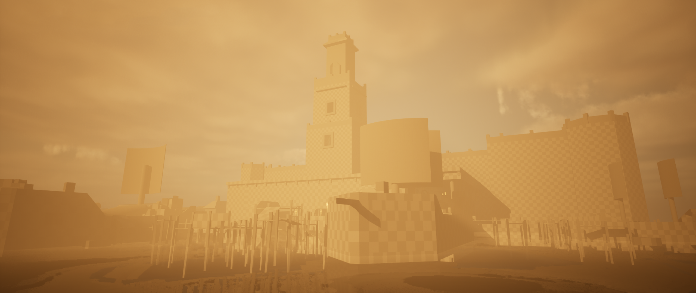
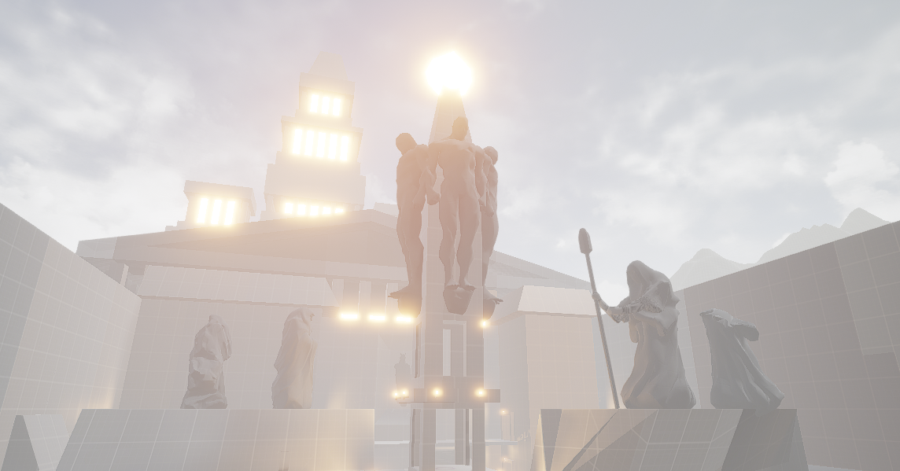

# Level Design Projects

## Garden’s Keeper

> ESMA - Rennes  
> Student Project - 2023 - 1 Month  
> Phaser  3 - Javascript  
> Solo project  

Garden's Keeper is a first-year student project, the aim of which was to create a **Zelda-like game**. 

This project was a challenging experience in setting up **interesting navigation through the levels**, and defining **level identities with art, mechanics and mobs**. It was also an opportunity to understand and apply the characteristics of early Zelda level designs: **valuing exploration** or **gaining abilities that unlock access** to new areas.

I made the level design on **Tiled**, a 2D level design program compatible with the Phaser 3 game engine.

### If you are interest to reach more about this project: 
[Itch.io page if you want to test this game!](https://maerys.itch.io/gardens-keeper)  
[Game Design & Programming Oriented Presentation](https://github.com/Doerys/Portfolio/blob/main/3_Projects/Garden's%20Keeper.md)  
[Level Design pre-production document (in french)](Documents/ZeldaLike_LevelDesignDocument.pdf)  

## G-Complex

> ESMA - Rennes  
> Student Project - 2023 - 1 Month  
> Document  
> Team of 5  

G-Complex is a first-year student group project whose goal was to create connected levels of a **non-linear 2D Side Scroller**, following the level design model of **Metroidvania**. The game was based on the mechanics of the **VVVVV video game**.

Working on this project has enabled me to learn how to **communicate with others on Level Design issues**, in order to create a continually **stimulating experience**, with a **progressive difficulty curve**. A great deal of thought was given to the **acquisition of new abilities** and their impact on level design situations and player's progression. In addition, the Metroidvania model prompted me to think about **backtracking** in level design, and how to keep the player motivated after reaching the end of a level.

### If you are interest to reach more about this project: 
[Level Design document (in french)](Documents/GComplex_LevelDesignDocument.pdf)

## The Golden Harbor

> ESMA - Rennes  
> Student Project - 2023 - 1 Month  
> Unreal Engine 5.2  
> Solo project

This 2nd-year student project was my first **3D level design project**. The goal was to create a level at the blocking stage and make navigation interesting, while giving a sense of scale by using different volume proportions.

The Golden Harbor is an **Unreal Engine’s level**, where the player takes on the role of a pirate crossing a harbor to reach the top of a building hiding a treasure. 

The design of Golden Harbor enabled me to develop my **3D level design skills** and become familiar with the Unreal Engine tools used in blocking, such as **BSP Brushes** and the **Modeling Mode**. It was also the opportunity to learn more about **Lights** in Unreal, but also how to place them correctly in order to lead the player’s navigation through the level. Finally, I learned the basics of the **Post Process Volume**, enabling me to create a foggy atmosphere.

### If you are interest to reach more about this project: 
[Video - Walkthrough with commentary (in french)](https://youtu.be/HHwTF6_Nwms)  

## Battle For Olympus

> ESMA - Rennes  
> Student Project - 2024 - 3 Months  
> Unreal Tournament Editor  
> Solo Project

Battle For Olympus is a second-year student project using Unreal Tournament 4's map editor to create a completely new level within the original game. It's a capture-the-flag map, pitting teams of 10 players against each other.

Working on this project has enabled me to improve my skills on blocking level design using Unreal Engine’s tools. But more than that, I was able to learn more about PvP and FPS gameplay-oriented level design. I also familiarize myself with the iterative process of level design while keeping a written record of this process, by creating a production document detailing my workflow.

The project also provided an opportunity to learn more about Unreal Engine features such as Landscape Mode, Exponential Height Fog and Lights.

### If you are interest to reach more about this project: 
[Production Document (in french)](Documents/BattleForOlympus_LevelDesignDocument.pdf)  
[Video - Walkthrough with commentary (in french)](https://youtu.be/CUc7tQvNdik)  
[Video - Full Match](https://youtu.be/cGsnamamYLk)  
