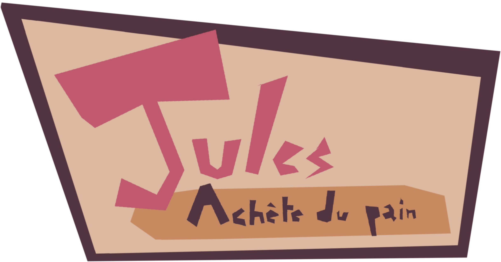
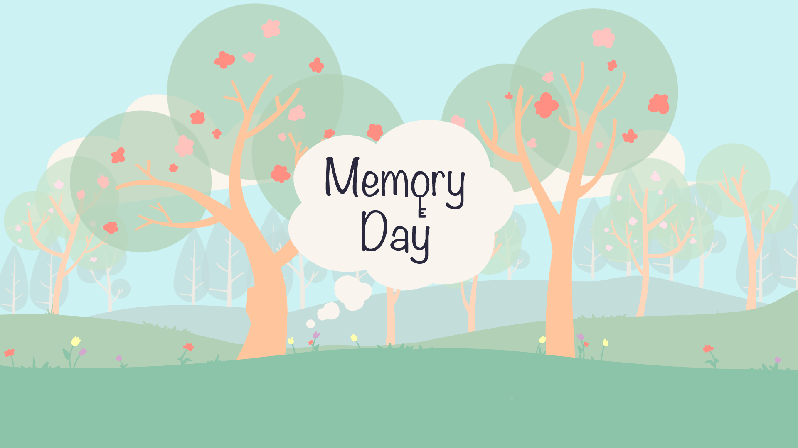
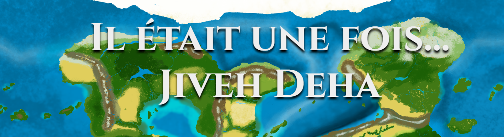

# Storytelling and Worlbuilding Projects

## Away from me

> Paris 3 Sorbonne Nouvelle - Paris  
> Student Project - 2021 - 4 Months  
> Literary Bible - Team of 4  
> Lead Game Designer, Narrative Designer, Maps Creation  

This is a semester-long project in a **Worldbuilding class**, which involves inventing and documenting the components of a **fictional universe** in order to develop a story in the medium of our choice. We chose Video games as the medium for our story.

Away from me is a **single-player, open-map action-adventure game**. You play as Hana, a survivor in a drowned post-apocalyptic world, trying to rescue her son kidnapped by a sectarian civilization established on an archipelago.

This project enabled me to strengthen my **Game Concept skills** (Core Gameplay, Gameplay Loops, 3Cs, Game Sequences and Rhythm). But above all, it has enabled me to build a solid foundation in Worldbuilding, by thinking collectively through the components of our fictional universe (Topology, Climate, Culture, Religion, Politics, Social Strata and Bestiary), in a way that was consistent with the themes, tone of our story, video game media and gameplay mechanics. All of which is fully documented in a **Literary Bible**.

Finally, this project was also an opportunity to familiarize myself with **Wonderdraft**, a map creation tool useful to create maps of fictional universes.

### If you are interest to reach more about this project: 
- [Literary Bible (in french)](Documents/LiteraryBible_AwayFromMe.pdf)

## Jules achète du pain

> Global Game Jam - Theme “Duality”  
> Game Jam project - 2023 - 2 days  
> Video Game - Team of 5  
> Unity  
> Game Designer, Narrative Designer, Sound Designer  

In this game, the player takes on the role of Jules, an ordinary man who has to cross a town to buy bread. But along the way, Jules encounters a series of absurd situations that systematically confront him with **two choices**: one leading to death, the other to the continuation of the story. But both choices are absurd, and **there is no way of knowing which is the right one**.

During the creation of the game, I was responsible for conceiving the story, making the narrative choices and writing the narrative story. I also carried out sound and musical research to give the game its ambience.

**Post Portem**: As much fun as we had imagining this game, and as playable as it is, I have the feeling that **our ambitions were far too big** for a simple game jam. Our highly productive artists found it hard to cope with the artistic workload involved in such a concept. If I had to do it all over again, I'd scale back the project's ambitions, particularly as regards the game's narrative branches, which systematically involved new illustrations.

### If you are interest to reach more about this project: 
- [Itch.io page if you want to test this game!](https://nonogg.itch.io/jules-achte-du-pain)  

## L’échappée du Red Phoenix

> ESMA - Rennes  
> Student Project - 2023 - 1 Month  
> Solo Project  
> T-RPG Scenario  

L’échappée du Red Phoenix is a 4 hours T-RPG scenario taking place in a **space opera universe**, where the players have to escape the spaceship in which they are prisoners. This scenario includes **exploration, fights, puzzles, infiltrations and social interactions**.

This school project was produced as part of a narratology course. The goal was to create a T-RPG scenario inspired by a **short story** I wrote earlier in the year. At the time, I was used to the exercise of creating T-RPG scenarios, the game mastering and practice of T-RPGs being one of my main hobbies. But this project was a real interesting challenge, because of the constraints involved and the need to create a professional-quality document.

### If you are interest to reach more about this project: 
- [Scenario document (in french)](Documents/ScenarioTRPGL'echappeeDuRedPhoenix.pdf)  
- [L’Etoile d’A’lanir, the short story that inspired this scenario (in french)](Documents/ShortStory_L'Etoiled'A'lanir.pdf)

## Memory Day

> Build Your Own Game 2023 - Themes "One day, it will all make sense" / "That's not how it happened"  
> Game Jam project - 2023 - 2 days  
> Video Game - Team of 3  
> Phaser 3  
> Game Designer, Narrative Designer, Programmer  

Memory Day is a very simple **puzzle game**, with the ambition of focusing on a short but touching story. After a mother and daughter bury a time capsule, the player is propelled years later and opens the capsule, plunging into the memories of a mother-daughter relationship.

During this game jam, I took on the role of **Game Designer**, working out the little puzzles to be solved, **Narrative Designer**, drawing up the narrative framework, and **Programmer**, developing the game on Phaser 3. The experience was extremely refreshing. We were able to take advantage of the game jam context to explore the narrative dimension of video games while keeping things very simple, without falling into the trap of over-ambitiousness, unlike Jules achète du pain.

### If you are interest to reach more about this project: 
- [Itch.io page if you want to test this game!](https://maerys.itch.io/memory-day)  

## Jiveh Deha - Yoha Vhayhe Civilization

> ESMA - Rennes  
> Student Project - 2024 - 4 Months  
> Worldbuilding Bible - Full class Project / Team of 4  
> Team Leader, Worldbuilder, 2D Art, Maps Creation  

This school project was carried out as part of an **Art Direction class**, which involved creating a fictional world inhabited by **multiple civilizations**, each of which had to be invented, documented and illustrated by a specific group within an entire class of students.

Working on our civilization was an opportunity to reinforce my learning of **Worldbuilding**, which I had already begun on my previous work Away From me.

I was also able to reinforce my skills in **creating maps and photobashing using Photoshop**. The scope of the project enabled me to learn how to work within a large group (a class of 20 students), including communication between teams to maintain consistency between our work.

### If you are interest to reach more about this project:
- [Worldbuilding Bible (in french)](Documents/Worldbuilding_Bible.pdf)

---

[Get back to the project page](../../MyProjects.md)  
[Get back to the main page](../../../README.md)