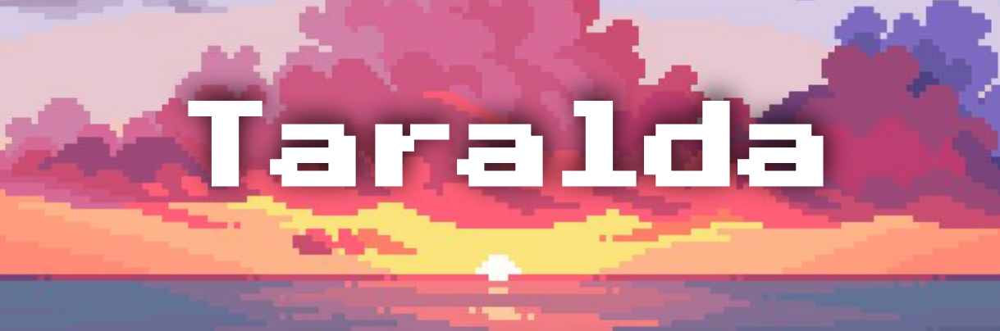
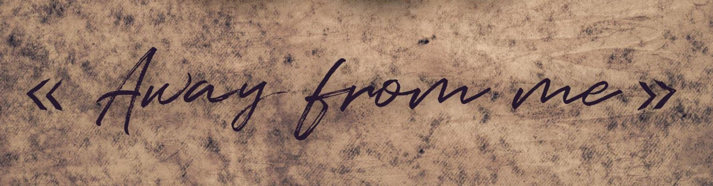

# Storytelling and Worlbuilding Projects

## Taralda

> Paris 3 Sorbonne Nouvelle - Paris  
> Student Project - 2021 - 4 Months  
> Game Design Document  
> Team of 4  
> Lead Game Designer, Art Direction, Level Designer, Narrative Designer  

This is a semester-long project for a Narrative Design course, consisting in conceptualizing and documenting a narrative game concept.

Taralda is a strategy game in which the player guides a group of plane crash survivors onto an isolated island. The main goal is to leave the island, which is in the grip of a war between the tribes living there. The game incorporates narrative choice mechanisms, allowing the player to choose between different narrative directions, maintaining diplomatic or conflictual relations with the island's tribes.

This project introduced me to many elements of Game Concept and Game Design: Core Gameplay, Gameplay Loops, 3C, Game Mechanics, Game Feel, User Experience, Walkthrough, Game Sequences & Rhythm. Taralda taught me how to include this information in a game design document. In addition, I was able to improve my narrative skills by thinking through all the components of the game (themes, game mechanics, art, world-building) in order to serve a narrative purpose.

If you are interest to reach more about this project: 

[Game Design Document (in french)](Documents/GameDesignDocument_Taralda.pdf)

## Away from me

> Paris 3 Sorbonne Nouvelle - Paris  
> Student Project - 2021 - 4 Months  
> Literary Bible  
> Team of 4  
> Lead Game Designer, Narrative Designer, Maps Creation

This is a semester-long project in a Worldbuilding course, which involves inventing and documenting the components of a fictional universe in order to develop a story in the medium of our choice. We chose video games as the medium for our story.

Away from me is a single-player, open-map action-adventure game. You play as Hana, a survivor in a drowned post-apocalyptic world, trying to rescue her son kidnapped by a sectarian civilization established on an archipelago.

This project enabled me to strengthen my Game Concept skills (Core Gameplay, Gameplay Loops, 3Cs, Game Sequences and Rhythm). But above all, it has enabled me to build a solid foundation in Worldbuilding, by thinking collectively through the components of our fictional universe (Topology, Climate, Culture, Religion, Politics, Social Strata and Bestiary), in a way that was consistent with the themes, tone of our story, video game media and gameplay mechanics. All of which is fully documented in a Literary Bible.

Finally, this project was also an opportunity to familiarize myself with Wonderdraft, a map creation tool useful to create maps of fictional universes.

If you are interest to reach more about this project: 

[Literary Bible (in french)](Documents/LiteraryBible_AwayFromMe.pdf)

## L’échappée du Red Phoenix

> Esma - Rennes  
> Student Project - 2023 - 1 Month  
> T-RPG Scenario  
> Solo Project

L’échappée du Red Phoenix is a 4 hours T-RPG scenario taking place in a space opera universe, where the players have to escape the spaceship in which they are prisoners. This scenario includes exploration, fights, puzzles, infiltrations and social interactions.

This school project was produced as part of a narratology course. The goal was to create a T-RPG scenario inspired by a short story written earlier in the year. At the time, I was used to the exercise of creating T-RPG scenarios, the game mastering and practice of T-RPGs being one of my main hobbies. But this project was a real interesting challenge, because of the constraints involved and the need to create a professional-quality document.

If you are interest to reach more about this project: 

[Scenario document (in french)](Documents/ScenarioTRPGL'echappeeDuRedPhoenix.pdf)  
[L’Etoile d’A’lanir, the short story that inspired this scenario (in french)](Documents/ShortStory_L'Etoiled'A'lanir.pdf)

## Jiveh Deha - Yoha Vhayhe Civilization

> Esma - Rennes  
> Student Project - 2024 - 4 Months  
> Worldbuilding Bible  
> Full class Project - Team of 4  
> Team Leader, Worldbuilder, 2D Art, Maps Creation  

This school project was carried out as part of an art direction course, which involved creating a fictional world inhabited by multiple civilizations, each of which had to be invented, documented and illustrated by a specific group within an entire class of students.

Working on our civilization was an opportunity to reinforce my learning of world-building, which I had already begun on my previous work Away From me.
I was also able to reinforce my skills in creating maps and photobashing using Photoshop. The scope of the project enabled me to learn how to work within a large group (a class of 20 students), including communication between teams to maintain consistency between our work.

If you are interest to reach more about this project:

Worldbuilding Bible
