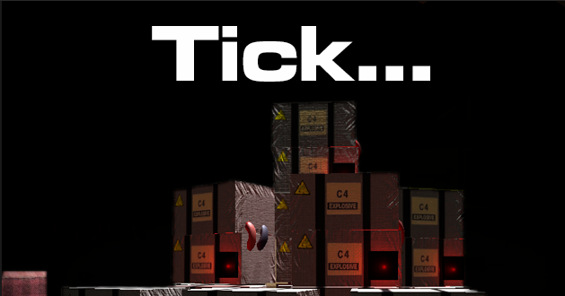
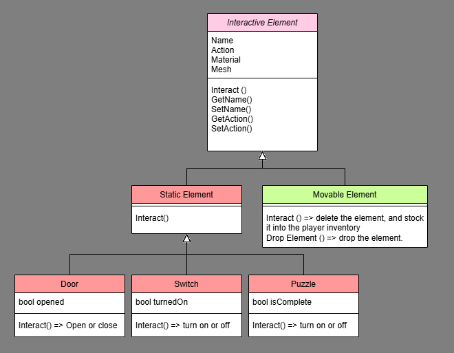
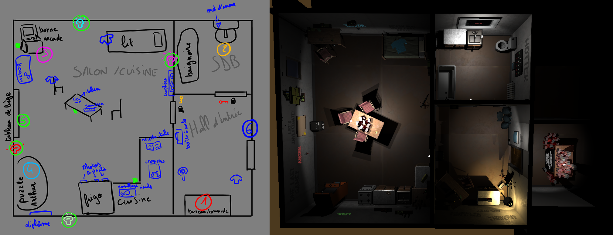

# Tick...

> Esma - Rennes  
> Student Project - 2024 - 2 Months  
> Unity - C#  
> Team of 5  
> Gameplay Programmer  

## Context

“Tick...” is a school project whose main goal was to create an **Escape Room-style video game** as part of a team of students specializing in programming and 3D modeling.

As a detective tracking down a dangerous criminal, the player finds himself trapped in the apartment of the alleged culprit. The player must solve the sordid riddles left by the criminal before a timer runs out and triggers a deadly explosion.

## What I Did

### Game Designer

One of my responsibilities was to create **increasingly difficult puzzles** for the player as he progressed through the game. The puzzles had to be **varied in their resolution logic**, to maintain the player's interest and curiosity. Among the 8 puzzles, we have puzzles relying on observation, reflex, deduction, searching and manipulation. 

**Post Mortem about Game Design Issues**: lack of time prevented us from doing playtests. But they would have been welcome to check the difficulty level of the puzzles, some of which were more difficult than expected. This issue made me realize the **importance of playtesting**, especially for puzzle-based games.

### Gameplay Programmer

As a student specialized in Programming, I was in charge of the **Programming of the 3C and the puzzles**. The main challenge of this game was to enable a **wide variety of actions and events** triggered by the same “Interact” action / input. To achieve this, we set up scripts mainly based on parenting. This approach prevented many problems and simplified the implementation of puzzles with very different logics.

Emphasis was also placed on time management, as the game was time-limited. I created a Timer Manager script, designed to create progressive changes as the game progressed. I incorporated feedbacks playing on the color of the lights and the frequency of the bombs' beeps, to keep the player informed of the time remaining before the end.

### Others

#### 3D Assets Implementation

3D artists' shortcomings in implementing 3D assets in Unity put me in charge of **implementing Meshes and Materials** into the game engine. 

#### Level Designer

I was in charge of the Level Design, arranging the Escape Room elements to create both an **intuitive sequence of puzzles** for the player and a **credible environment**.

#### Lights

As with the 3D implementation, there was a gap in the integration of light, which I tried to fill by placing and adjusting the **lights and post-processing volume** myself, to create a dark, oppressive environment. There's still room for improvement, as the environment remains too dark, making it difficult for the player to see the environment well enough to solve certain puzzles.

## What I Learned

One of the main challenges of the project was working with another programmer. I organized my programming architecture to maintain a **collaborative and functional coding environment**. This allowed me to improve my **communication skills** with other programmers. It was also an opportunity to think more carefully about how to **structure my programming architecture** to simplify and organize my code.

Although the few gaps in artistic integration were not expected, it was an opportunity for me to learn more about the **integration of meshes, materials and lights** in Unity. Managing all these assets got me used to keeping a project well organized by learning how to place files in the right place.

## More About This Projet
[Itch.io page if you want to test this game!](https://maerys.itch.io/tick)
