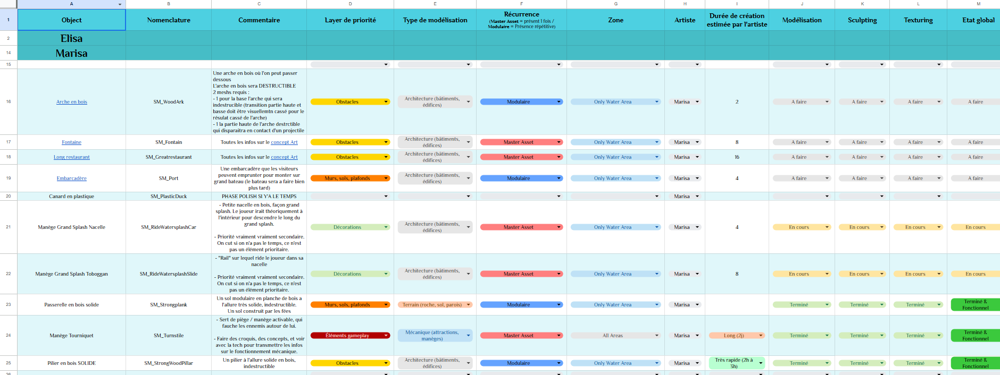
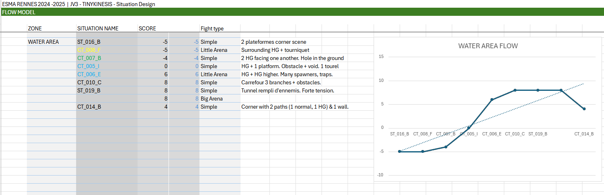
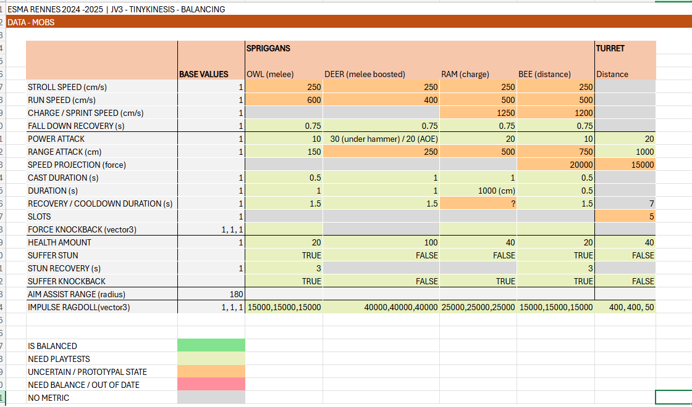
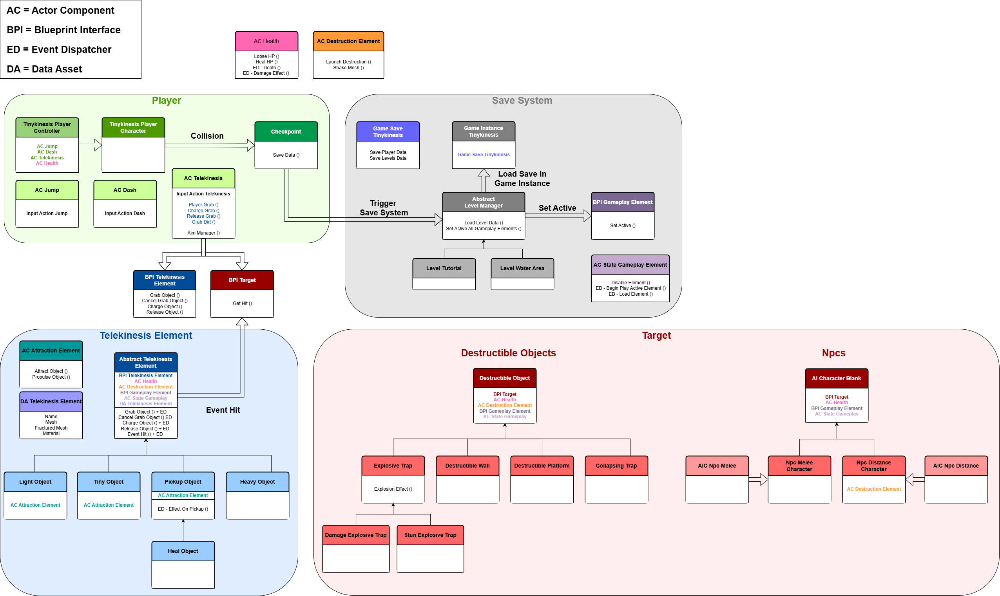

# Tinykinesis

> ESMA - Rennes  
> Student Project - 2024 / 2025 - 10 Months  
> Unreal Engine 5.4 - Blueprints  
> Team of 10  
> Head Game Designer, Gameplay Programmer, Narrative Designer

## Context

At the end of my studies at ESMA - Rennes, the graduation project was the **production of a 30-minute game**. Tinykinesis is the result of a concept proposed by myself and 2 friends, at the end of our second year, and selected for development in third year.

The game is a **Horde Shooter set in the colorful world of a tiny amusement park**. The player embodies Spark, a fairy who manipulates the environment with **Telekinesis**, in order to eliminate hostile elves who have invaded this park in **explosive and nervous first-person combats**, until managing to completely rid it of its invaders.

Tinykinesis is divided into three parts: an introductory level, a hub to which the player returns several times, and a level in an aquatic-themed area. In each level, the player follows a linear path through a **series of fights and closed arenas**.

## What I Did

### __Head Game Designer__

Before the start of our production, two classmates and I had to pass a project selection stage consisting of creating and presenting a game concept. I focused on Core Gameplay, Core Experience, 3Cs, Gameplay Loops, Target Audience and Narrative Design. After being selected, we were able to form a team of 10 people around our project.

My work was followed by a period of **research and development** focused on the game design of our concept. This included a study of games based on **telekinesis gameplay**, in order to establish satisfying and fun 3Cs.

When production began, I took charge of creating a whole series of documentations and lists designed to establish a **production line** for programmers (gameplay mechanics, game systems, AI behaviors) and artists (assets, animations, VFX, UI, SFX). Part of this production lists consisted of **GSheets spreadsheets**, designed to streamline work through data transfer, conditional formatting and scripting functionalities. Ongoing monitoring was essential to ensure communication and coherence between all production areas, and to ensure that all team members were moving in the same direction.

Here's a list a some documents (in french) if you're curious to take a look: 
- [3D Assets GSheets](https://docs.google.com/spreadsheets/d/1HP6hXy2p1-xy9E0DjHtM8QrNKBQiBWxi5ONVPVlf1K0/edit?usp=sharing)
- [Animation / VFX / UI GDocs](https://docs.google.com/document/d/1-U61As0INJPAUqkPD0VS4HjfMjLQAScBfLjO84TsVIo/edit?usp=sharing)
- [Sound Design GSheets](https://docs.google.com/spreadsheets/d/16XRFZfWOl8J3nragdCOnbpqCVKhDOHwO4_GSK3zB7SA/edit?usp=sharing)

_Here a view of a Sheet created to help 3D Artists manage their production._

Production time was devoted to situation design, aimed at __creating typical game situations__ that could be used in our levels. All this research was combined with the use of the flow model to establish sequences of situations following a flow curve, to ensure a __balanced progression of player experience and challenge__. All this research served as a working basis for level designers to organize levels and place combat situations according to the flow curve.

I did a __balancing pass__, using a spreadsheet to account all the game's metrics, including our character, mobs and the many gameplay elements we can interact with.

In order to gather user feedback to guide us through our production stages, I was able to create __user feedback forms__ and organize __playtests__.

[Here's an example of a form created to collect player feedback.](https://forms.gle/QoenwQDfmKKAx3pg7)

Finally, I took charge of much of the __group's organization__, including __preparing and summarizing__ meetings, but also __planning__ tasks and objectives __using project management tools__ such as Taiga.

### __Gameplay Programmer__

During the R&D phase, my investment in 3C programming was simply limited to __functional prototyping__ to test the possibility of creating telekinetic mechanisms in Unreal Engine 5.4. I was able to familiarize myself with __physics-related blueprint nodes__. However, 5 months into production (after the 3C prototype stage), circumstances led me to __officially take charge of the 3C Programming__.

Broadly speaking, the 3Cs can be summarized as __FPV camera management__, and the programming of player __movement abilities__ (running, double jump, dash) and __telekinesis__ (grabbing elements of the scenery to throw or crash into mobs). Part of the development involved creating gameplay elements with __specific behaviors__, such as projectiles. I also partially __implemented the animations__ in the Animations Blueprints.

[Montrer une séquence de gameplay]

As I took on the role of 3C programmer late in production, I had to discover and familiarize myself with an architecture and programming structure that was already in place, but which lacked opitimization after the 3C prototype phase. My job was therefore to reappropriate and optimize this code, notably by __restructuring the architecture__ to better implement functions, by changing the parenting systems, and by using the functionalities offered by Unreal Engine such as Blueprint Interfaces, Events Dispatcher, Actor Components or Data Assets.

_Here's the state of the architecture after I restructured and optimized it._

I was also able to set up a save and respawn system based on checkpoints. This involved creating a Level Manager using Game Instance and Game Save to store player data and the state of game elements that could be “destroyed” by the player, in order to make them appear (or not) in the level after a respawn.

[Montrer dans le moteur le système de save]

### __Documents, Presentations & 2D Art__

In order to present our concept, research and work, we frequently had to create documents and slide presentations. My job was to __establish the structure of the presentation, the chaptering, the argumentation and the layout of the elements__ in the documents/presentations. The presentation involved __creating templates__ using Google Slides.

Here's some examples of documents & presentations: 

- R&D Document (later)
- [Vertical Slice Presentation](https://docs.google.com/presentation/d/1kQIxMveelr9L9FkTKPtwQgkKWRK9zZWhQdfQXfuI8n4/edit?usp=sharing)

I was able to lend a hand to a member of our group for the 2D creation of the [Game Design Document](Documents/Tinykinesis_GameConceptDocument.pdf), using Photoshop to create a thematic skin.

### __Project organization__

Part of my organizational work was dedicated to keeping our Github repository up and running, including __managing merges and conflicts__ between all project branches, __creating backup branches__ throughout production, and __managing global merges__ prior to builds.

I also took charge of putting the Unreal project itself in order, whether by __structuring folders and sub-folders__, establishing __file naming rules__, or __creating documentation__ to frame this project organization.

### __Level Design__

As Game Designer, I frequently gave __feedback and instructions__ to the Level Designers. Occasionally, during more intensive production periods, I'd come along to give the level designers a hand in __rearranging, balancing or dressing up__ certain parts of the level.

## What I Learned

Because of its duration and scope, this project taught me a lot. I learned how to work in an organized way within a __large multi-specialist team__, on a single project spread over a year. This meant learning all the issues involved, such as __communication, meetings, task planning and setting up sprints__.

In __Game Design__, it was a challenging project in terms of __adaptations and revisions__ to be made to the concept over the long term, taking into account feedback throughout production. I was also able to develop skills in __spreadsheet management, balancing and document creation__.

In __Gameplay Programming__, I learned a lot about Unreal Engine and became familiar with a __wide range of features and tools__, including Characters and Controllers, Widget Blueprints, Input Actions, Actor Components, Event Dispatchers, Blueprint Interfaces and Animation Blueprints. I also understood the logic of Behavior Trees and Blackboards, even though I wasn't in charge of AI programming. I dabbled a little in Materials and Niagara Systems, to understand the basics, but I wasn't in charge of that either. Finally, in terms of thinking about programming, I __developed my programming architecture skills__ a lot.

## More About This Projet
[Itch.io page if you want to test this game!](https://barna-bus.itch.io/tinykinesis)
