# Here's a small portrait of things that bring me joy

## Video-Games

### The Last of Us serie

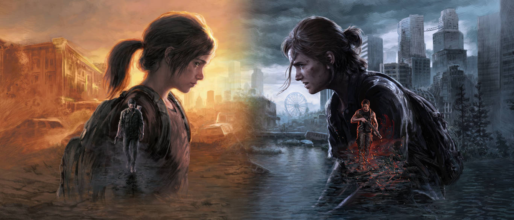

### Life is Strange serie

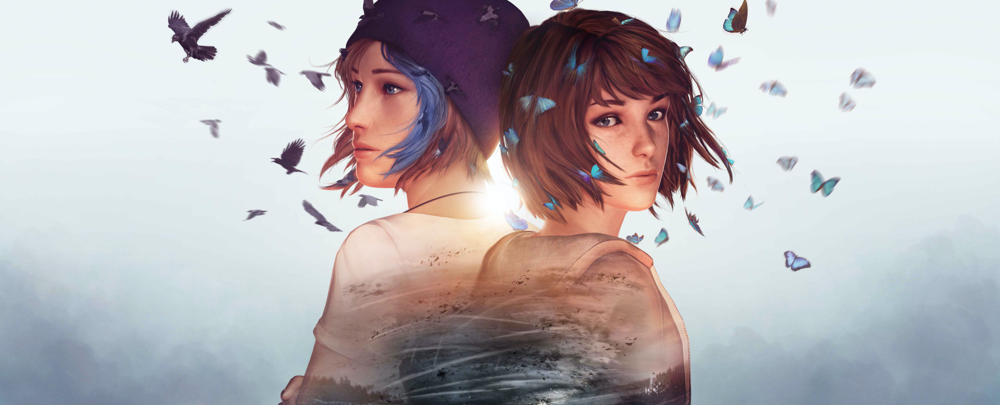

### Plague Tale serie

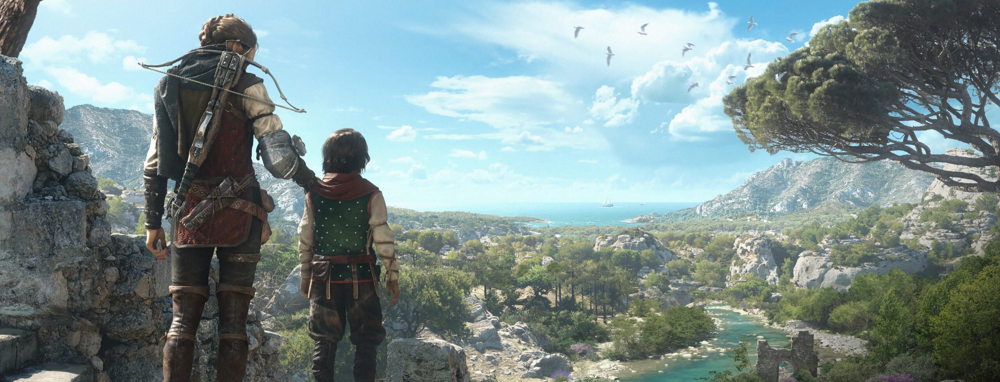

### The Witcher serie

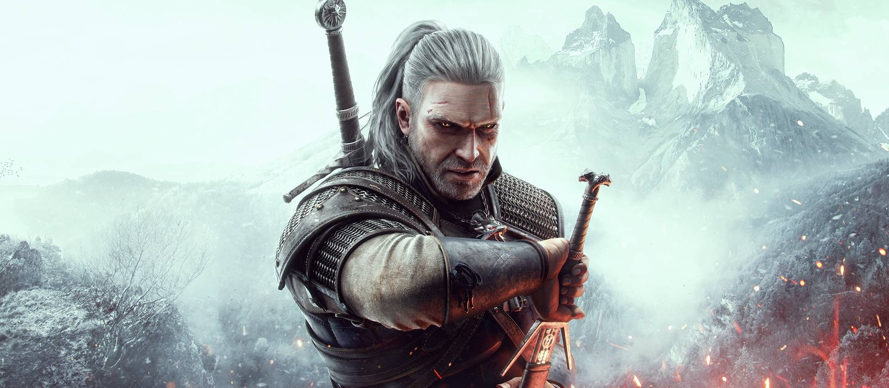

### Baldur's Gates 3

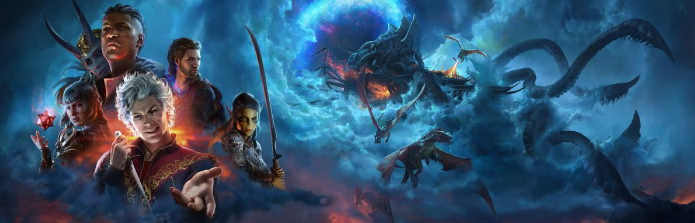

### Warcraft Saga

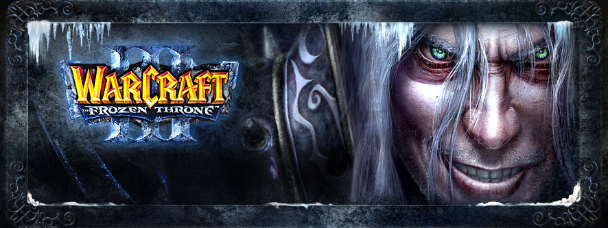

### Overwatch

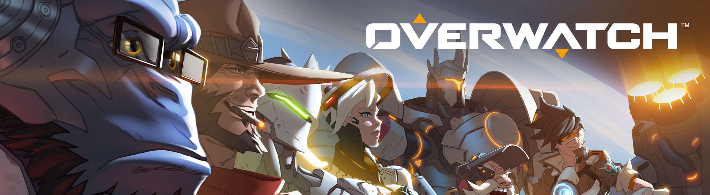

### Hellblade serie

### This War of Mine

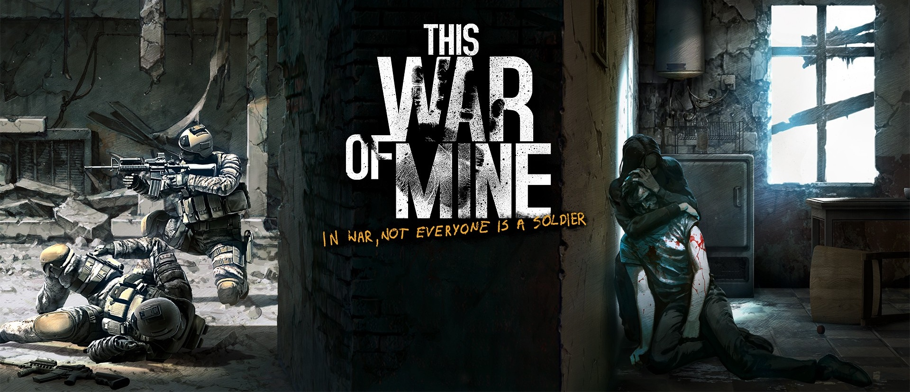

## Films / Series

### The Lord of the Rings Trilogy

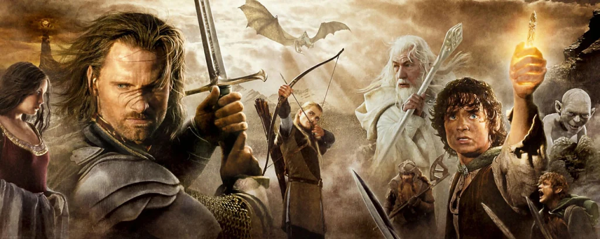

### Hunger Games Quadrilogy

### Everything Everywhere All At Once

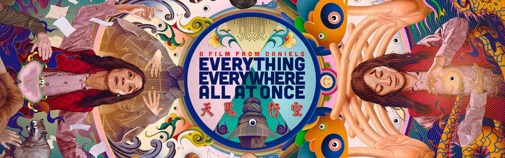

### Arcane

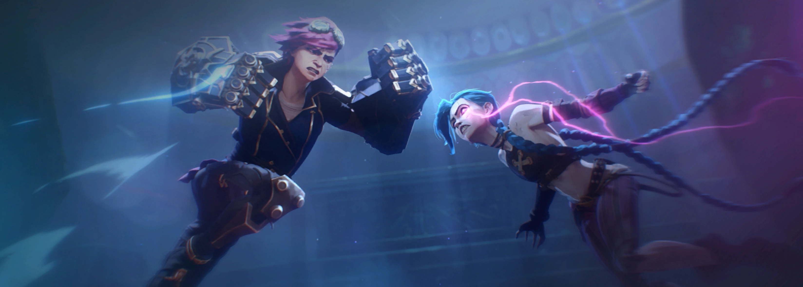

### Avatar: The Last Airbender

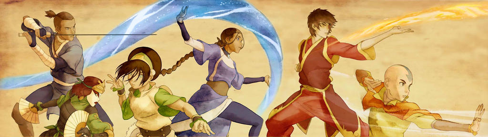

### She-ra and the Princesses of Power (Netflix)

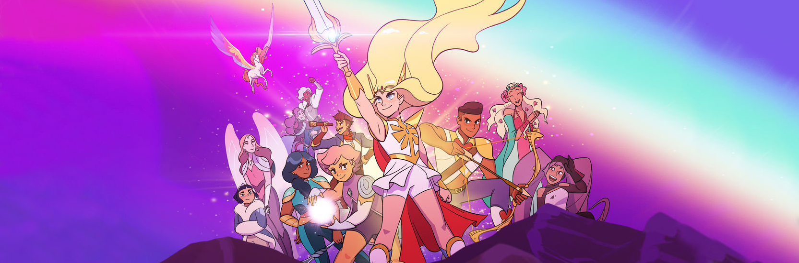

### The Amazing World of Gumball

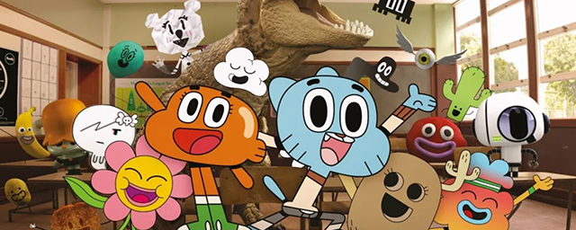

### South Park

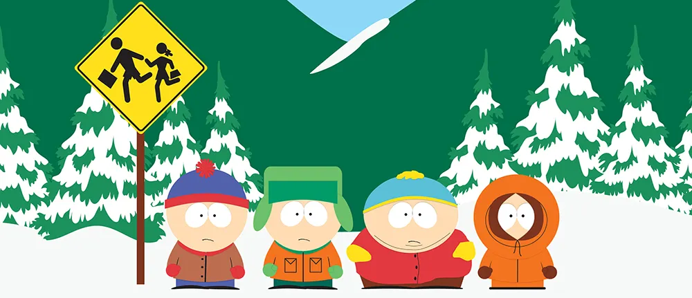

### Attack on Titans

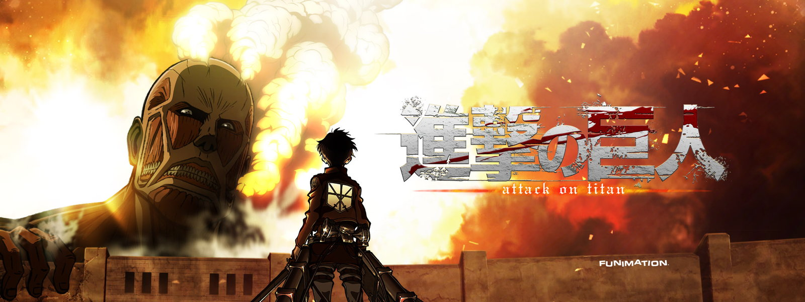

### Violet Evergarden Saga

## Music

### The Soundtracks of Video Games and Films / Series above ↑

### Films, Series & Video Games Scores (Hans Zimmer, Neal Acree, Jeremy Soule, Ramin Djawadi, Bear McCreary)

### 2000, 2010's Pop (Lady Gaga, Avril Lavigne, Ariana Grande, The Chainsmokers, Coldplay and more)

### Musicals (Wicked, The Greatest Showman, West Side Story, Disney Animated Movies, Hazbin Hotel)

## Others

### Writing (shorts stories, novels, scenarios, poems and more)
### T-RPG (Dungeon and Dragons 5e, Critical Role Universe)
### Mass Larp (Kandorya)
### Voice Acting and Roleplaying
### Boards Games
### Walking hours to go nowhere and stay stuck in my mind

---

[Get back to the main page](../README.md)
